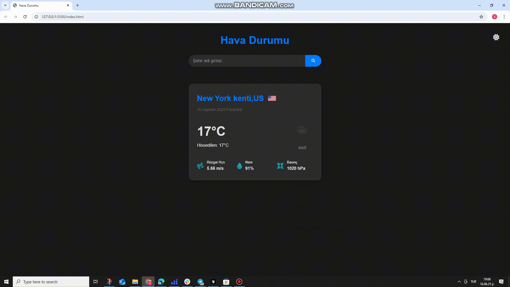

# 🌦️ Weather App - Hava Durumu Uygulaması

## 📌 Proje Açıklaması
Bu proje, kullanıcıların şehir ismi girerek anlık hava durumu bilgilerini alabilecekleri interaktif bir web uygulamasıdır. Modern frontend teknolojileri kullanılarak geliştirilmiştir.

## ✨ Özellikler
- Gerçek zamanlı hava durumu verileri
- Şehir arama özelliği (Türkiye şehirleri)
- Karanlık/Aydınlık tema desteği
- Responsive tasarım (tüm cihazlarda uyumlu)
- Animasyonlu geçişler

## 🛠 Teknolojiler
- HTML5
- JavaScript (ES6+)
- SCSS

